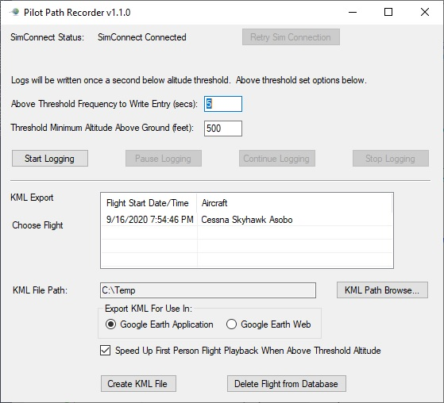
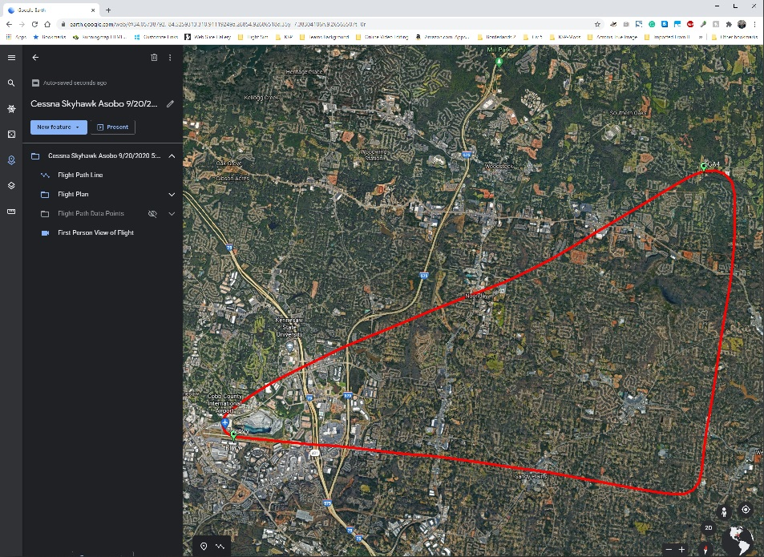
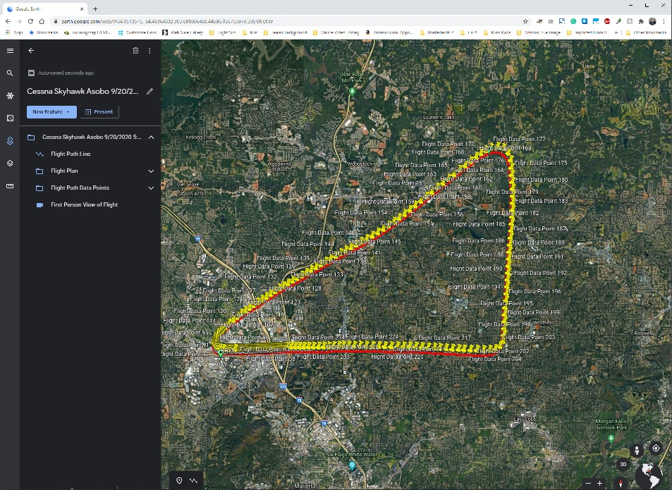
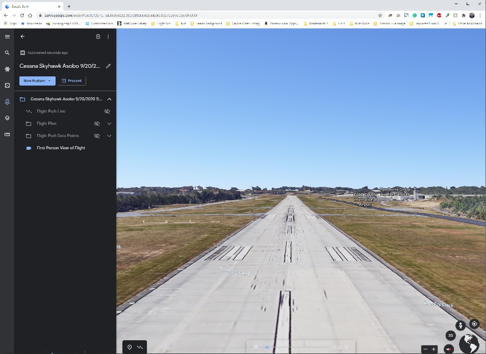

# MSFS2020-PilotPathRecorder
Record your flight path with key flight information archived during the trip.  Then export that data to a KML file to use with Google Earth for 3 dimensional flight analysis, flight plan information and a chance to review your flight from the first person perspective.

This is a stand-alone application that must be run outside of Microsft Flight Simulator 2020.  Once run, this application allows the user to set various settings to control the recording and exporting experience.  A database is used to store your flights so feel free to fly during one session and export in another.

## Instructions for use
Note that the Flight Simluator should be up and running before launching Pilot Path Recorder.  If not, then click Retry Sim Connection until you get the "SimConnect Connected" message.  Next choose the write frequency of how often to write to the database when above the minimum altitude threshold. Adjust the minimum altitude threshold as well.  For example if you want to write every 30 seconds when above ground by 5000 feet use the values 30 and 5000 respectfully.

Before start a logging session, start a flight in the simulator and click 'Start Logging' when you are ready to start the recording.  You may pause at anytime using the pause function and continue logging when ready.  'Stop Logging' ends the recording for that flight.

When ready, choose a flight (newest are on the top) and if needed pick a directory to store the KML file.  Click 'Create KML File' to export the data to a KML file in the location chosen. Be sure to choose whether you will be using Google Earth application or Google Earth Web to view your KML. There are a few differences between the applications that will hamper your experience if you use the application different than you chose when the KML file was exported. 

You may also keep your database clean and tidy by deleting a flight from the database.  

Once you have a KML file, you may either use Google Earth on the web (earth.google.com) or download and install Google Earth (https://www.google.com/earth/) for your computer.

If using Google Earth web do the follwing to load the KML file:
1. Click the Hamburger menu icon and pick projects
2. Click open and Import KML from computer.  
3. Find KML file and select it.  
Note to look at another KML file, you may want to click the trash icon on the current Flight Data to make the map less confusing

If using Google Earth application:
1.  Find the KML file on your computer and double-click or press enter to automatically start Google Earth and use this KML file

At this point you should see the path and flight plan if your flight involved one..  With either tool expand the 'Flight Data' line and either click the eye icon (web version) or checkbox (Google Earth computer version) to turn on or off any layer or particular pin from your flight.  To see detailed information of the various flight paramters, click a pin to see what was going on at that particular moment of your flight. 

Click on First Person View to review your flight from the first person perspective. You can use first person view with any of the other layers turned on or off.

## Instructions for install
1. Install .NET 4.7.2 - download can be found at https://dotnet.microsoft.com/download/dotnet-framework/net472

2. Download Pilot Path Recorder zip file from the releases area of this project: https://github.com/SAHorowitz/MSFS2020-PilotPathRecorder/releases

3. Unzip contents of Pilot Path Recorder to a directory

4. Launch FS2020PlanePath.exe to start Pilot Path Recorder
